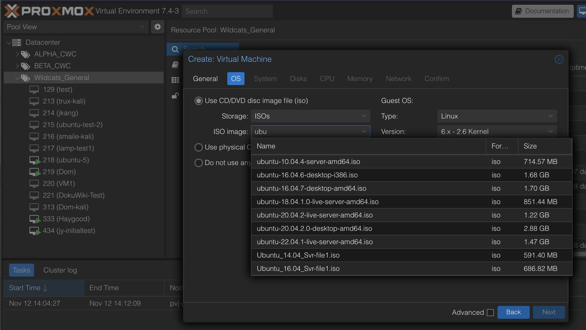

# Install Ubuntu Server 

To complete this exercise, you will need access to the [Cyberwildcats Proxmox](https://cyberwildcats.net/pages/resources.html#Proxmox) [Hypervisor Cluster](https://10.1.11.33:8006).  Please note that [Cyberwildcats VPN](https://cyberwildcats.net/pages/resources.html#VPN) access is also required.  The [Cyberwildcats Proxmox Usage Manual](https://docs.google.com/document/d/10za4H5M7x0PT7BJGLX9eKB7RoPmtZBwR/edit?usp=sharing&ouid=116857645506738452141&rtpof=true&sd=true) will also be very helpful to you.

Login to the Proxmox cluster and create a new Windows VM in the Cyberwildcats Pool.  Be sure to include your Cyberwildcats Slack handle in the VM name.  Use one of the available Ubuntu Desktop ISO files as your ISO image to boot from.

After installing the operating system, install one or more of the following server packages.  

* [SSH server](services/ssh.md)
* [Apache web server](services/apache.md)
* [Postfix mail server](services/postfix.md)
* [Samba SMB file server](services/samba.md)
* [MySQL database server](services/mysql.md)
* [Postgresql database server](services/postgres.md)
* [BIND DNS server](services/bind.md)
* [Network File System (NFS)](services/nfs.md)